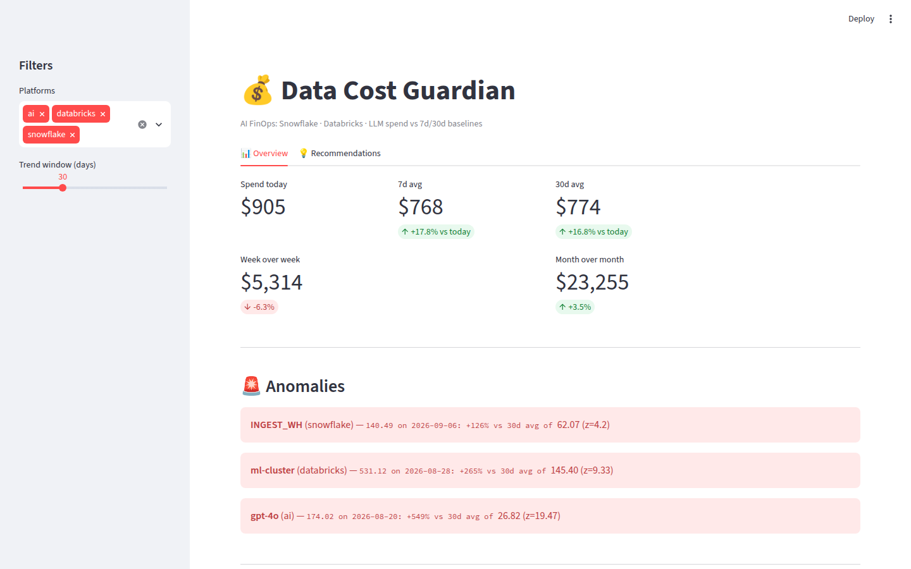
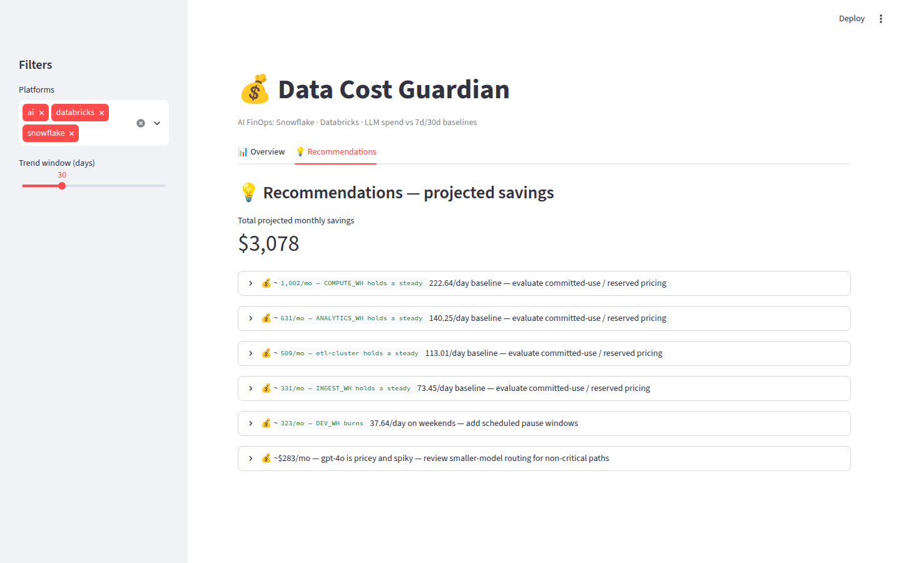

# Data Cost Guardian

**A simple tool for watching Snowflake, Databricks, and AI costs.**

Data Cost Guardian helps a company answer three questions:
1. Where is our money going?
2. Did any cost suddenly increase?
3. What can we change to save money?

It shows the answers in a dashboard and can send an alert when it finds a problem.
> **Note:** FinOps means managing and improving technology spending.

---
## Screenshots

**Overview tab** — daily spend vs 7-day and 30-day averages, with anomalies flagged:


**Recommendations tab** — concrete fixes with projected monthly savings:

---

## Why this project exists
Cloud costs can increase quickly.

For example:
- A Snowflake query may run many times by mistake.
- A Databricks cluster may stay on overnight.
- A large data job may run again when it is not needed.
- An application may send too many requests to an AI model.

A company may not notice until the monthly bill arrives. Data Cost Guardian checks costs every day so the team can investigate sooner.
---

## What the tool does

- **Collects cost data** from Snowflake, Databricks, and AI services.
- **Learns the normal range** by looking at the last 7 and 30 days.
- **Finds unusual increases** in daily cost.
- **Shows the biggest cost drivers** by platform, service, and team.
- **Suggests ways to save money** and estimates the possible monthly savings.
- **Displays the results** in a Streamlit dashboard.
- **Creates alerts** in the terminal, a Markdown report, or Slack.

---

## How it works

```text
Snowflake + Databricks + AI cost data
                  |
                  v
        Collect and organize data
                  |
                  v
       Find unusual cost changes
                  |
                  v
     Create cost-saving suggestions
                  |
                  v
          Dashboard and alerts
```

## Architecture

```
┌─────────────┐  ┌──────────────┐  ┌─────────────┐
│  Snowflake  │  │  Databricks  │  │  AI APIs    │
│ ACCOUNT_    │  │ system.      │  │ OpenAI stub │
│ USAGE.*     │  │ billing.     │  │ + CSV import│
│             │  │ usage        │  │             │
└──────┬──────┘  └──────┬───────┘  └──────┬──────┘
       │  connectors.py │  (live → demo fallback) │
       └────────────────┼────────────────┘
                        ▼
              ┌──────────────────┐
              │   analyzer.py    │  daily rollups by platform → service → team
              │  7d / 30d avgs   │  WoW / MoM deltas · top drivers
              │  anomaly detect  │  threshold % + z-score
              └────────┬─────────┘
                       ▼ findings.json
        ┌──────────────┴──────────────┐
        ▼                             ▼
┌───────────────┐            ┌────────────────┐
│ dashboard.py  │            │   alerts.py    │
│ Streamlit +   │            │ console summary│
│ Plotly KPIs,  │            │ alerts.md      │
│ trends,       │            │ Slack webhook  │
│ callouts      │            │ payload        │
└───────────────┘            └────────────────┘
```

### Step 1: Collect cost data

The connectors read cost and usage information from each platform.

- Snowflake: warehouse usage and query history
- Databricks: billing and usage information
- AI services: model usage and cost from a CSV file

If a real platform is not connected, the tool can use demo data for that platform.

### Step 2: Understand normal spending

The tool looks at recent history to understand what is normal for each warehouse, cluster, or AI model.

It uses:

- A 7-day average for recent behavior
- A 30-day average for a more stable view

### Step 3: Find unusual spending

The tool uses two checks:

- **Percentage check:** Is today's cost at least 50% higher than normal?
- **Z-score check:** Is today's cost very different from the service's usual pattern?

A z-score is simply a way to measure how unusual a number is.

For example, if a service normally costs between $90 and $110 per day, a cost of $160 is unusual. The z-score helps the tool recognize that difference.

The tool ignores services costing less than $10 per day by default. This reduces small, unimportant alerts.

### Step 4: Suggest ways to save money

The tool looks for four common situations:
- **Idle resource:** A warehouse or cluster is barely used on many days. It may be possible to turn it off sooner or use a smaller size.
- **Weekend spending:** A development or test service keeps running on weekends. It may be possible to pause it.
- **Steady high spending:** A service has a stable, high monthly cost. A committed-use discount may be worth reviewing.
- **Expensive AI model:** A costly AI model has uneven usage. Some work may be suitable for a smaller model.

Each suggestion includes:
- The reason for the suggestion
- The estimated monthly savings
- A confidence level
- The expected effort

The tool does not make changes automatically. A person should review every suggestion first.
---

## Example results

The included demo data produces six recommendations with about **$3,078 in possible monthly savings**:
- COMPUTE_WH: review committed-use pricing — about $1,002 per month
- ANALYTICS_WH: review committed-use pricing — about $631 per month
- etl-cluster: review committed-use pricing — about $509 per month
- INGEST_WH: review committed-use pricing — about $331 per month
- DEV_WH: pause it on weekends — about $323 per month
- gpt-4o: review smaller-model routing — about $283 per month

**Important:** These are estimates from demo data, not guaranteed savings. Some estimates use assumptions, such as a 15% committed-use discount or moving 30% of AI traffic to a smaller model. Real recommendations must be checked against actual contracts, workloads, and quality needs.
---

## Try it without real accounts

You do not need Snowflake, Databricks, or OpenAI accounts to try the project.
The project includes 90 days of realistic demo data. The demo contains normal spending, weekend patterns, and intentional cost increases. This lets anyone see the full process without sharing credentials.
---

## Quick start

These steps work on macOS and Linux.
### 1. Open the project folder

```bash
cd data-cost-guardian
```

### 2. Create and activate a Python environment

```bash
python3 -m venv .venv
source .venv/bin/activate
```

### 3. Install the required packages

```bash
pip install -r requirements.txt
```

### 4. Run the demo

```bash
python -m src.main --demo --report
```

This creates:

- `data/daily_spend.csv` — daily cost data
- `data/findings.json` — unusual costs and top cost drivers
- `data/recommendations.json` — cost-saving suggestions
- `alerts.md` — a readable alert report

### 5. Open the dashboard

```bash
streamlit run src/dashboard.py
```
Streamlit normally opens the dashboard in your web browser. If it does not, open the local address shown in the terminal.

### Other useful commands

Use 60 days of demo data and a 30% alert level:

```bash
python -m src.main --demo --report --days 60 --threshold 30
```

Run the project without cost recommendations:

```bash
python -m src.main --demo --report --no-recommendations
```

Run the automated tests:

```bash
pytest tests/
```
---

## Connect real cost data

Connecting real accounts is optional.

Copy `.env.example` to a new file named `.env`, then add the connection details for the platforms you want to use.

```bash
cp .env.example .env
```

### Snowflake

The Snowflake connector reads:

- `WAREHOUSE_METERING_HISTORY` for warehouse credit usage
- `QUERY_HISTORY` for query and user information

### Databricks

The Databricks connector reads:

- `system.billing.usage` for usage by cluster and product type

### AI services

AI cost data can be loaded from `data/ai_costs.csv`.

The file should contain these columns:

```text
date,model,tokens_in,tokens_out,cost
```

Example:

```text
2026-09-01,gpt-4o,120000,45000,2.35
```

If a platform is not connected, the project uses demo data for that platform and shows a message in the terminal.
**Security:** Keep `.env` private. Do not upload it to GitHub.

---

## Slack alerts

Slack alerts are optional.

Set a Slack webhook before running the project:

```bash
export SLACK_WEBHOOK_URL="https://hooks.slack.com/services/..."
```

If a Slack webhook is not set, the project prints the alert information in the terminal instead.

---

## Main settings

The main settings are in `config.yaml`.

You can change:

- The 7-day and 30-day comparison windows
- The 50% cost increase level
- The z-score level
- The $10 minimum daily cost
- The rules used to create savings suggestions
- The number of days in the demo

You can change these settings without changing the Python code.

---

## Project files

```text
data-cost-guardian/
├── config.yaml
├── .env.example
├── requirements.txt
├── alerts.md
├── data/
│   ├── daily_spend.csv
│   ├── findings.json
│   └── recommendations.json
├── src/
│   ├── main.py
│   ├── demo_data.py
│   ├── connectors.py
│   ├── analyzer.py
│   ├── recommender.py
│   ├── alerts.py
│   └── dashboard.py
└── tests/
    ├── test_analyzer.py
    └── test_recommender.py
```

- **`main.py`:** Runs the full process.
- **`demo_data.py`:** Creates realistic demo cost data.
- **`connectors.py`:** Gets data from Snowflake, Databricks, and AI sources.
- **`analyzer.py`:** Finds unusual spending and the biggest cost drivers.
- **`recommender.py`:** Creates cost-saving suggestions and estimates savings.
- **`alerts.py`:** Creates reports and sends notifications.
- **`dashboard.py`:** Shows the results in Streamlit.
- **`test_analyzer.py`:** Tests cost analysis and unusual-spending detection.
- **`test_recommender.py`:** Tests recommendations and savings calculations.

---

## What the dashboard shows

The dashboard has two main parts.
### Overview

- Total spending
- Daily cost trend
- Spending by platform
- Spending by service and team
- Unusual cost increases
- Biggest cost drivers

### Recommendations

- Suggested action
- Reason for the suggestion
- Estimated monthly savings
- Confidence level
- Effort level

---

## What this project does not do

- It does not promise that the estimated savings will be achieved.
- It does not change or stop cloud resources automatically.
- It does not use machine learning for detection. The current rules use averages, percentages, z-scores, and simple calculations.
- It does not replace a full business review of contracts, performance, or AI quality.

This is intentional. The project keeps the logic easy to understand, test, and explain.
---

## Why this is a useful portfolio project

Many platforms already provide cost dashboards. This project shows how cost data from Snowflake, Databricks, and AI services can be brought into one simple view.

It also goes beyond monitoring. It explains what may be wrong, suggests an action, and estimates what the action could save.

The project can be run in a few minutes with demo data, so a reviewer can see the complete flow without using a real company account.

---

## Possible future improvements

- Explain cost increases in plain English with an LLM
- Forecast future spending
- Track budgets
- Send email notifications
- Support more cloud platforms
- Add team-level cost allocation
- Add safe, human-approved actions

---

## In one sentence

**Data Cost Guardian watches cloud data and AI costs, finds unusual spending, and suggests ways to save money before the monthly bill arrives.**
